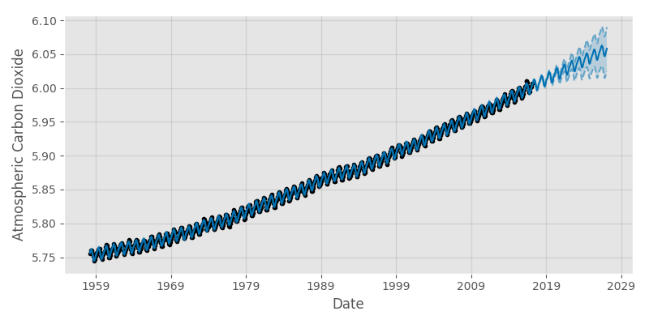
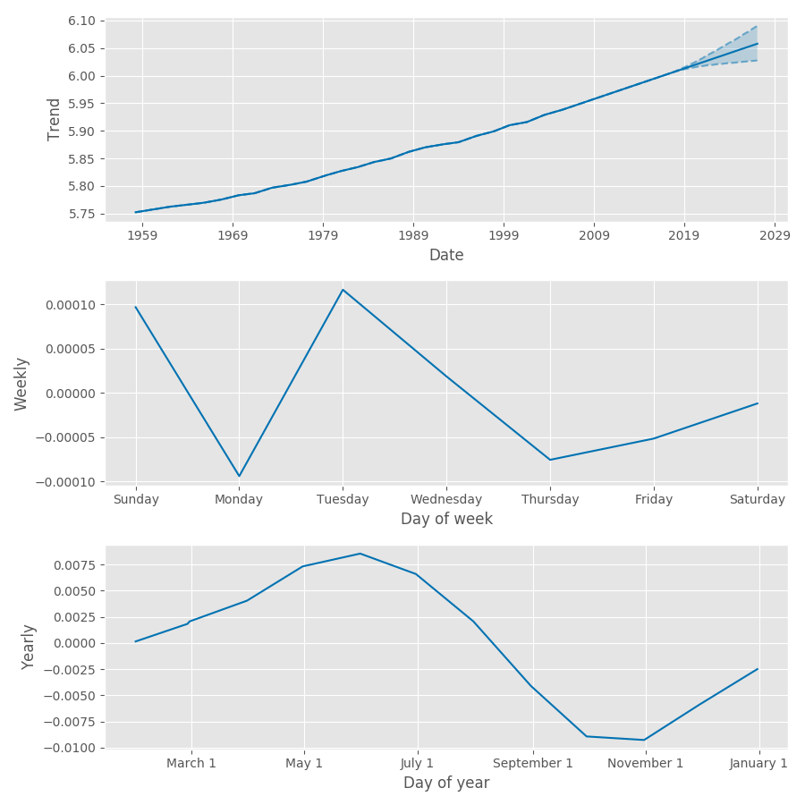
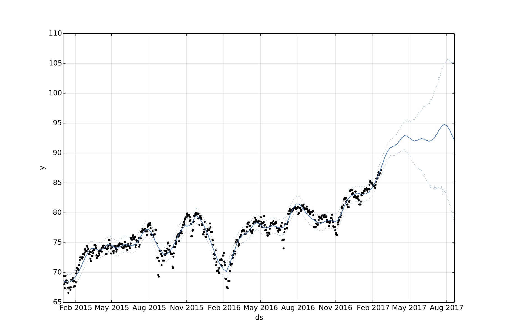
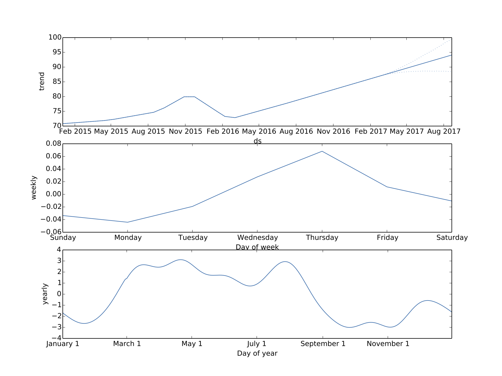

Facebook recently released
[Prophet](https://facebookincubator.github.io/prophet/) as a time series
forecasting procedure. It is available with both Python and R as front-end while the back-end heavy lifting is implemented in Stan. Driven by the type of time series forecasted at Facebook, Prophet works with piecewise trends, multiple seasonaltiy and floating holidays. It works best with daily periodicity data with at least one year of historical data. In this post we look at Prophet and take it for a spin.

## Model
Prophet frames the time series forecasting problem as a curve-fitting exercise. The dependent variable is a sum of three components. The first component is growth. Prophet accomodates both non-linear and linear growth. Non-linear
growth is modeled using a logistic growth model with a time-varying carrying capacity; linear growth is modeled using a simple piece-wise constant function. Changepoints (where growth rate is allowed to change) are modeled using a vector of rate adjustements, each corresponding to a specific point in time. The rate adjustment variable is modeled using a Laplace distribution with location parameter of 0. Analysts can specify changepoints by providing specific dates or by adjusting the scale parameter associated with the Laplace distribution. The second component is periodic seasonality; it is modeled using a standard Fourier series. For yearly and weekly seasonality the number of approximation terms is 20 and 6
respectively. The seasonal component is smoothed with a normal prior. The last component is holidays. Holidays are modeled using an indicator function. The indicator function takes on a value of 1 on holidays and is multiplied with a
smoothing prior which is normally distributed. For both seasonal and holiday priors, analysts can adjust the spread parameter to model how much of the historical seasonal variation is expected in the future. 

The dependent variable is assumed to follow a normal distribution and, along with the above mentioned priors, is fit in Stan. 

## Using Prophet

We run Prophet on two types of datasets - one that should be easy, one more challenging. The first is monthly data on Mauna Loa carbon dioxide levels; the second is daily close price for an S&P sector exchange traded fund (ETF).

### Mauna Loa CO2 levels

```python
m = Prophet()
m.fit(df)
future = m.make_future_dataframe(periods=120, freq = 'm')
forecast = m.predict(future)
```
The monthly historical CO2 data is highly seasonal with a strong trend; we expect Prophet to easily pick up both components. Running Prophet and setting the frequency argument for monthly data gives the following forecast. 


As expected, both periodicity and trend are captured. When we look at the plot for the trend component only, we see a strong linear trend. Notice the weekly component is mostly noise - this makes sense because we do not expect to see any weekly seasonality in CO2 admissions. On the other hand, the plot of yearly component shows the impact of northern hemisphere vegetation levels on carbon dioxide levels; the levels are higher in the summer and lower in the fall.



### SPY Sector ETF

```python
m = Prophet(changepoint_prior_scale=0.02)
m.fit(df);
future = m.make_future_dataframe(periods=180)
forecast = m.predict(future)
```
Next we run Prophet on the Consumer Discretionary S&P Sector ETF (XLY) using daily close price from
2015 onwards. We experiment with Prophet's ability to automatically detect changepoints by adjusting the changepoint smoothing parameter. Instead of the default value of 0.05, we set the changepoint smoothing parameter to be 0.02. This should make the resulting trend less flexible. 




As expected, the resulting two figures clearly show the effect of the changepoint smoothing
parameter - the model using a smoothing parameter of 0.02 is less susceptible
to noise and has a smaller uncertainty band. The trend component plot captures the large trends since 2015 nicely - XLY has generally been trending up except for the beginning of 2016 when markets were hit by worries about China's slowdown and a slumping oil price. The weekly component plot is mostly noise. The plot of yearly component shows the shifted effect of consumer discretionary spending - higher in February through July and lower elsewhere.  




## Advantages of Prophet

In our report on Probabilistic Programming we pointed out that Stan allows one to quantify the probability of all outcomes and not just determine the most likely. We also noted that one can transfer institutional knowledge about the quantities to be measured. We see both of these advantages in Prophet. Prophet provides a fully specified posterior - for some use cases it can be insightful not just to have a point estimate. Prophet also allows users to adjust priors used for seasonality and changepoint detection - this allows users to apply extensive domain knowledge without requiring much understanding of the underlying model. Lastly, Prophet separates out the trend and seasonality effect, making it easy to confirm one's intuition of the data. 
