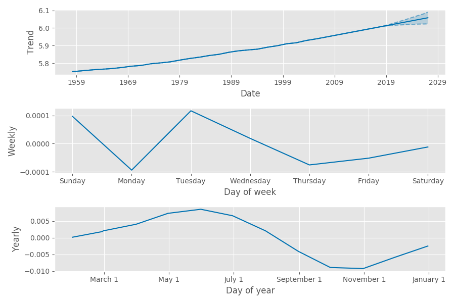

Facebook recently released
[Prophet](https://facebookincubator.github.io/prophet/) as a time series
forecasting procedure. It is based on an additive model with growth,
seasonality and holiday effects. Prophet is available with both Python and R as front-end while the back-end heavy lifting is implemented in Stan. The development of Prophet is driven by the nature of the time series forecasted at Facebook (piecewise trends, multiple seasonality, floating holidays). An example use case cited in the paper is forecasting the number of events on Facebook. In this post we look at Prophet and take it for a spin.

## Model

Prophet frames the time series forecasting problem as a curve-fitting exercise.
The dependent variable is a sum of three components. The first component is
growth. Prophet accomodates both non-linear and linear growth. Non-linear
growth is modeled using a logistic growth model with a time-varying carrying capacity;
linear growth is modeled using a simple piece-wise constant function.
Changepoints are modeled using a Laplace distribution with location parameter of 0. Analysts can specify changepoints by providing specific dates or by adjusting the scale parameter associated with the Laplace distribution. The second component is
periodic seasonality, which is modeled using a standard Fourier series. For
yearly and weekly seasonality the number of approximation terms is 20 and 6
respectively. The seasonal component is smoothed with a normal prior. The last
component is holidays. Holidays are modeled using an indicator function. The
indicator function takes on a value of 1 on holidays and is multiplied with a
smoothing prior which is normally distributed. For both seasonal and holiday priors, analysts can adjust the spread parameter to model how much of the historical seasonal variation is expected the future. 

The model is assumed to follow a normal distribution and, along with the above mentioned priors, is fit in Stan. 

## Using Prophet

We run Prophet on two types of datasets - one that should be easy, one more challenging. The first is monthly data on Mauna Loa carbon dioxide levels; the second is daily close price for a S&P sector exchange traded fund (ETF).

### Mauna Loa CO2 levels

```python
m = Prophet()
m.fit(df)
future = m.make_future_dataframe(periods=120, freq = 'm')
forecast = m.predict(future)
```
The monthly historical CO2 data is highly seasonal with a strong trend, we expect Prophet to easily pick up both components. Running Prophet and setting the frequency argument gives the following forecast. 


As expected, both periodicity and trend are captured. When we look at the plot for the trend component only, we see a strong linear trend. Notice the weekly component is mostly noise - this makes sense because we don't expect to see any weekly seasonality in CO2 admissions. On the other hand, the plot of yearly forecast component shows the impact of northern hemisphere vegetation levels on carbon dioxide levels; the levels are higher in the summer and lower in the fall.




### SPY Sector ETFs

Next we run Prophet on the nine S&P Sector ETFs using daily close price from
2015 onwards. Here we discuss the results for XLY (Consumer Discretionary). To
avoid overfitting we set the changepoint smoothing parameter to be 0.02 instead
of the default value of 0.05. 


These two figures clearly show the effect of the changepoint smoothing
parameter - the model using a smoothing parameter of 0.02 is less susceptible
to noise and has a smaller error band. The plot of yearly forecast component
shows the shifted effect of consumer
discretionary spending - higher in February through July and lower elsewhere.  


```python
m = Prophet(changepoint_prior_scale=0.02)
m.fit(df);
future = m.make_future_dataframe(periods=180)
forecast = m.predict(future)
```
## Advantages of Prophet

Using Prophet to forecast the dependent variable enables us to separate out the
trend and seasonality effect. In some cases it could be a helpful way to gain
intuition from the data. When used on financial time series, the model enables
one to design a trading strategy based on the forecast. Since Prophet provides
a fully specified posterior, the risk profile of such a strategy can also be
specified. As mentioned in our report on Probabilistic
Programming, using Stan gives a fully specified posterior and allows us to
quantify the probability of all events. In addition, it allows a user to transfer institutional knowledge by specifing priors in the Stan model.

