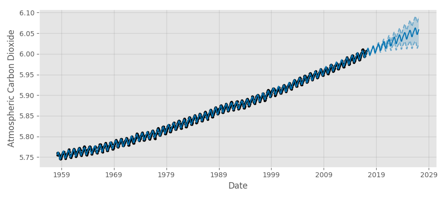
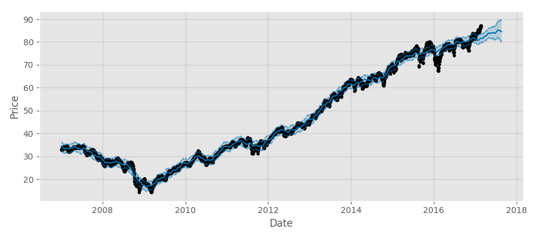
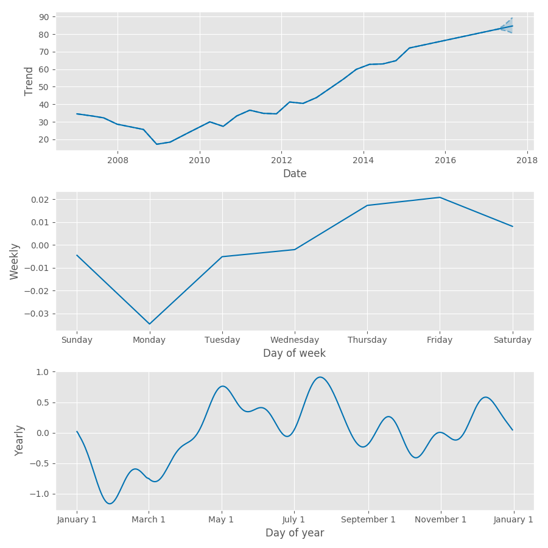

Facebook recently released
[Prophet](https://facebookincubator.github.io/prophet/), a general purpose time
series forecasting package with both Python and R interfaces.

Python and R already have plenty of time series forecasting options, so what's
the big deal about Prophet? The reason it caught our eye is that the backend is
implemented in Stan, a probablistic programming language we spent some time
working with in our most recent report.

This choice means that Prophet offers many of the advantages of the Bayesian
approach that we discuess in depth in our recent report. In particular, the
models have a simple, interpretable structure (seasonality) on which prior
analyst knowledge can be imposed, and forecasts include confidence intervals
derived from the full posterior distribution, which means they offer a
data-driven estimate of risk.

In this post, we take Prophet for a spin, looking at its user interface and
performance with a couple of datasets.

## The model

Prophet implements a general purpose time series model that is suitable for the
kind of data seen at Facebook. It offers piecewise trends, multiple seasonality
(day of week, day of year, etc.) and floating holidays.

Prophet frames the time series forecasting problem as a curve-fitting exercise.
The dependent variable is a sum of three components: growth, periodic
seasonality, and holidays.

Prophet models nonlinear **growth** using a logistic growth model with a
time-varying carrying capacity. It models linear growth using a simple
piecewise constant function. Changepoints (where growth rate is allowed to
change) are modeled using a vector of rate adjustements, each corresponding to
a specific point in time. The rate adjustment variable is modeled using a
Laplace distribution with location parameter of 0. Analysts can specify
changepoints by providing specific dates or by adjusting the scale parameter
associated with the Laplace distribution. 

Prophet models **periodic seasonality** using a standard Fourier series. For
yearly and weekly seasonality the number of approximation terms is 20 and 6
respectively. The seasonal component is smoothed with a normal prior. 

Finally, **holidays** are modeled using an indicator function. The indicator
function takes 1 on holidays and is multiplied by a normal smoothing prior.

For both seasonal and holiday priors, analysts can adjust the spread parameter
to model how much of the historical seasonal variation is expected in the
future. 

## Using Prophet

The model is specified in [a short Stan
listing](https://github.com/facebookincubator/prophet/blob/master/python/stan/unix/prophet_linear_growth.stan)
that gets compiled behind the scenes when the user install the library. The
user need never touch the Stan code, and works with Prophet entirely through
its Python or R interfaces.

To test these interfaces, let's run Prophet on an infamous dataset with extremely
strong seasonality: [atmospheric carbon dioxide as measured on the Hawaiian
volcano of Mauna Loa continuously since the
1950s](https://www.esrl.noaa.gov/gmd/ccgg/trends/full.html).

Having prepared a pandas DataFrame, running Prophet is just a couple of lines:

```python
m = Prophet()
m.fit(maunaloa)
future = m.make_future_dataframe(periods=120, freq='m')
forecast = m.predict(future)
```

This code takes a couple of seconds to run and yields the following forecast:



Prophet's simple model is able to detect the strong annual periodicity and
long-term upwards trend easily. Note that the forecast comes with data-driven
confidence intervals for free --- a crucial advantage of probabilistic
programming systems.

Prophet also yields simple, interpretable results for the components (date, day
of week, day of year) of the time series decomposition.

```python
# Plot trend component
ax.plot(forecast['ds'], forecast['trend'], ls='-', c=forecast_color)
ax.fill_between(forecast['ds'].values,
                forecast['trend_lower'],
                forecast['trend_upper'],
                facecolor=forecast_color, alpha=0.2)
```
```python
# Plot Day of Week component
df_s = forecast.copy()
df_s['dow'] = df_s['ds'].dt.weekday_name
df_s = df_s.groupby('dow').first()
days = ['Sunday', 'Monday', 'Tuesday', 'Wednesday', 'Thursday', 'Friday', 'Saturday']
y_weekly = [df_s.loc[d]['weekly'] for d in days]
ax.plot(range(len(days)), y_weekly, ls='-', c = forecast_color)
```
```python
# Plot Yearly component
df_s = forecast.copy()
df_s['doy'] = df_s['ds'].map(lambda x: x.strftime('2000-%m-%d'))
df_s = df_s.groupby('doy').first().sort_index()
ax.plot(pd.to_datetime(df_s.index), df_s['yearly'], ls='-', c = forecast_color)
```


Notice the weekly component is much smaller than the other two, and likely
mostly noise -- this makes as the global atmosphere chemisty doesn't vary by
day of the week. On the other hand, the yearly component shows the seasonal
impact of northern hemisphere vegetation levels on carbon dioxide levels; the
levels are higher after summer and lower after winter.

### Economic data

Let's now run Prophet on a more challenging dataset, the XLY Exchange-Traded
Fund, which tracks a market-cap weighted index of [Consumer Discretionary
stocks drawn from the S&P 500](https://www.google.com/finance?chdnp=1&chdd=1&chds=1&chdv=1&chvs=maximized&chdeh=0&chfdeh=0&chdet=1490040000000&chddm=502044&chls=IntervalBasedLine&q=NYSEARCA:XLY&ntsp=0&ei=mxrQWLHDDpTAmgGSzKHgBw),
a dataset with seasonality, lots of apparently random fluctuation, and even
anomalous behaviour. We take a daily closing prices back to 2007.

```python
m = Prophet(changepoint_prior_scale=0.2)
m.fit(xly);
future = m.make_future_dataframe(periods=180)
forecast = m.predict(future)
```

Here we experiment with Prophet's ability to automatically detect changepoints
by adjusting the changepoint smoothing parameter. Instead of the default value
of 0.05, we set the changepoint smoothing parameter to be 0.2. This makes the
resulting forecast more flexible and less smooth, but also more sucesptible
for chasing noise. If we're doing this for real we would of course conduct a
formal cross-validation or backtest to empirically determine the proper value
of this hyperparameter.



The trend component plot captures the large trends since 2007 nicely - XLY, with the rest of the market, nose dived in 2009 and has generally been trending up since. The weekly component plot is mostly noise again. The plot of yearly component shows the shifted effect of consumer discretionary spending on stock prices -- higher in May through
August and lower elsewhere.  



## Advantages of Prophet

In our report on Probabilistic Programming we emphasized that the Bayesian
approach, made simpler by probabilistic languages like Stan and pymc3, allows
developers and statisticians to quantify the probability of all outcomes and
not just determine the most likely. The prior and interpretability make the
models more practical.

Prophet makes these advantages concrete for a specific use case, forecasting.
It makes sensible choices for a general purpose time series modeling function,
and abstracts away the complexity of working with Stan behind idiomatic Python
and R user interfaces that makes the approach even easier and quicker for data
scientists and analysts.
