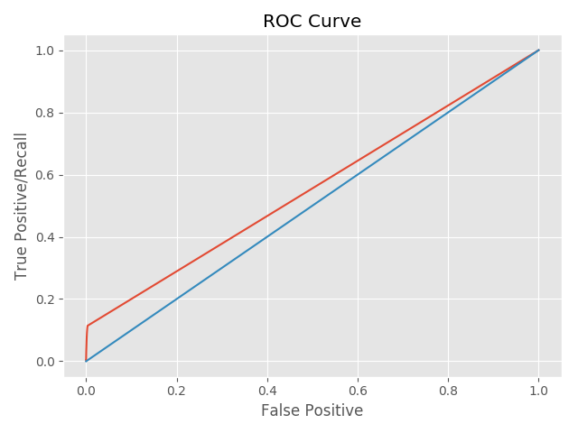
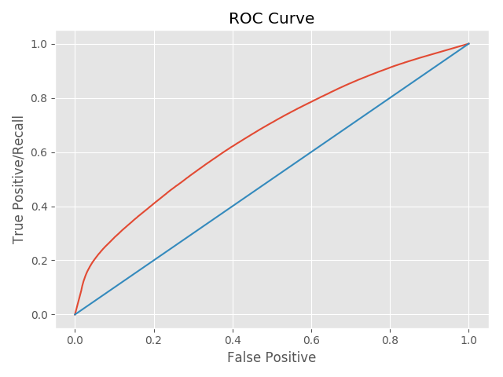

# Playing with Recommenders

We set out to build some basic recommendation systems using publicly available
data - here's what we learnt...

## Data

The first ingredient for building a recommendation system is user interaction
data. We experimented with two different datasets, one from Flickr and one from
Amazon. The Flickr dataset contains interactions between users and photos that
they liked; the Amazon dataset contains user ratings on books. Both datasets are
time-stamped; one has positive class data only while the other has granular
ratings data ranging from 1 to 5.

In recommendation systems it is important to remove both users who have
interacted with many items and items that have many ratings. Intuitively, users
who like many items do not add any information to our system as they are not
selective enough. Similarly, items that many users like will tend to be overly
recommended. To our clean dataset we filter out these cases. The dataset is
then split it into two (training and testing) using a cutoff timestamp.

## Building the Recommender

### Basic photo recommendation system

To quickly get a recommender up and running we used a Python scikit called
SURPRISE. The package has various built in recommendation algorithms including
ones based on neighborhood approach and matrix factorization. Because a
recommender needs to know both what a user liked and disliked, we use heuristics
to infer negative ratings. An example heuristic is to assume that *x* number of
photos before the *liked* photo are disliked.

With both positive and negative ratings we are ready to plug our data into
SURPRISE. To so do we transformed it into a text file that provides four pieces
of information {userid, photoid, rating, timestamp}, where rating is either a 1
or 5.

<!---
code from embed_old/collab_filter_knn_manualfold]
--->

The following code snippet shows how custom datasets can be defined and used in
SURPRISE. 

```python

from surprise import Dataset
from surprise import Reader

train_file = os.path.expanduser(data_path + 'train.data')
test_file = os.path.expanduser(data_path + 'test.data')
reader = Reader(line_format='user item rating timestamp', sep=';')
data = Dataset.load_from_folds([(train_file, test_file)], reader=reader)

```
Training a model and getting a prediction is straightforward.

```python

from surprise import dump
from surprise import KNNBasic
from surprise.accuracy import rmse

algo = KNNBasic(sim_options=sim_options, min_k=3)
for trainset, testset in data.folds():
    algo.train(trainset)
    predictions = algo.test(testset)
    rmse(predictions)
    dump('./dump_KNN', predictions, trainset, algo)

```

The ROC curve for our system is underwhelming - understandably so given our
sparse input data.



### Photo recommender with Tags

Can we build a better recommendation system if we make use of the tag
information that comes for free with the Flickr dataset? Instead of describing a
photo using its id (a series of numbers), we use tags like *sunset, bridge,
Brooklyn*. Since each column of the input matrix is now a tag (vs a photoid) and
each photo has a set of tags, the size of the input matrix is much larger. The
recommender gives us a set of tags and their corresponding scores for each
user. To get back a photo recommendation, these tag scores need to be converted
to photo scores. We use a simple weighted scoring system. Given a set of
tags(T) and their scores corresponding to a user, we find the common tags
between T and a particular photo. The common tag scores are summed up and
normalized by the number of common tags. All photos are ranked using this metric
and the top one is recommended. Once tag information is incorporated, our ROC
curve looks much better!



At this point we became more adventurous and built own recommender using
sklearn's implementation for non negative matrix factorization and locality
sensitive hashing forest.

### Basic book recommendation system

Our recommender based on Flickr's dataset required inferred negative
ratings. Amazon's user rating dataset, on the other hand, provides rating
information ranging from 1 to 5. To take advantage of this we build a book
recommender using our internal system and Spotlight, a PyTorch based
recommendation package. First, data is cleaned and separated into training and
testing sets using the same approach as the Flickr dataset. From here, we
transform the input data into a matrix form for our internal system and custom
*interactions* object for Spotlight. Both matrix factorization and neighborhood
based algorithms are used to build a recommendation engine and RMSE is evaluated
on the test dataset.

Here is how we plugged our data into Spotlight.

```python

from spotlight.interactions import Interactions
interactions = Interactions(np.asarray(reviewid, dtype=np.int32),					     np.asarray(bookid, dtype=np.int32),
                            np.asarray(ratings_all, dtype=np.float32))
```

Training and scoring the model is a two liner.

```python

from spotlight.factorization.explicit import ExplicitFactorizationModel
from spotlight.evaluation import rmse_score

model = ExplicitFactorizationModel(n_iter=1)
model.fit(sp_train[0])
rmse = rmse_score(model, sp_test[0])

```

Similar to the Flickr dataset, the results are underwhelming but expected for a
system built using only user and book ratings information.

### Book recommender with Subject

What if we now add some content information to the books? We do this using the
open library API. Instead of identifying a book by a number, we associate a
subject with it. Each column in our interaction matrix is now a subject rather
than a book ID. Since multiple books could be mapped to the same subject, our
input matrix is smaller and denser. Ratings that a user assigned for books with
the same subject is aggregated into a single rating for that particular
subject. To obtain a recommended rating on a book, we map the book to its
subject and read off that recommendation. With subject information, the RMSE
improves by approximately 2 fold across the board!

| Algorithm        | RMSE           | 
| :-------------: |:-------------:| 
| NMF (ID)        | 0.84 |
| NMF (Subject)   | 0.46 |
| Spotlight MF (ID)   | 0.62 |
| Spotlight MF (Subject)   | 0.27 |
| Random   | 0.38 |

## What we learnt

### Raw material

Data makes all the difference. Traditional recommendation systems do not work
well because of the sparsity problem. Each user only rates a small percentage of
items in the universe, but recommendation systems rely on this weak signal to
make decisions.

To make a better system we need a denser matrix in order to extract a stronger
signal. In our example we used content information - tags for the Flickr dataset
and subjects for the Amazon dataset. Both cases saw dramatic
improvements. Time-stamp information is also helpful because it makes the
problem amenable to some deep learning techniques. See our prototype on
recommendation systems which uses deep features as a way of extending the
factorization models!

### Does a basic recommendation system work?

A recommendation system built using matrix factorization or neighborhood
approaches trained on simple user-item interaction data is unlikely to give
great recommendations. In our experiment with the Amazon dataset, these
recommendation systems underperform a random system! Morever, because these
systems do not know how to recommend unseen items, their practical usage is
limited. That said, if you are building one, matrix factorization techniques
seem to have an edge over neighborhood methods from both sparsity and cold start
angles.

## What makes a good recommendation system?

If our prediction gives a 3.8 and the actual rating is a 5, did the
recommendation system do a good job?  Should we penalize all bad predictions
equally or should we assign a stronger blame for false positive than false
negatives? Alternatively, should recommendation systems be viewed as a ranking
problem rather than a prediction problem? Our experiment used basic metrics such
as recall and RMSE because it is easier to compare one single metric across
various platforms. Arguably, the only way to judge a recommendation system is to
put it in production and perform A/B testing.

Please see our report for more on recommendation systems! [FIX LINK]


